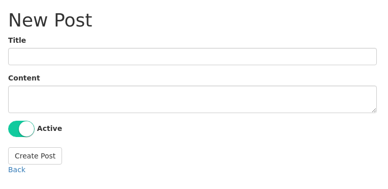

# SimpleFormCustomInputs



## Availables inputs

- [x] Switch/Toggle with Switchery
- [x] Masked inputs
- [x] File button
- [x] File drag n drop
- [x] Datepicker
- [ ] Datetimepicker
- [ ] Timepicker

## Installation

Add the following gems to your application's Gemfile:

```ruby
gem 'simple_form'
gem 'simple_form_custom_inputs'
gem 'bootstrap-sass'

source 'https://rails-assets.org' do
  gem 'rails-assets-switchery'
  gem 'rails-assets-jquery.maskedinput'
  gem 'rails-assets-bootstrap-datepicker'
end
```

And then execute:

```bash
$ bundle install
$ rails generate simple_form:install
```

## Usage

In app/assets/javascripts/application.js, you should add as follows:

```js
//= require ...
//= require switchery
//= require jquery.maskedinput
//= require bootstrap-datepicker
//= require simple_form_custom_inputs
//= require ...
```

Application.scss

```scss
@import "bootstrap-sprockets";
@import "bootstrap";
@import "switchery";
@import "bootstrap-datepicker";
@import "simple_form_custom_inputs";
```

Basic Example:

```erb
<%= simple_form_for :example do |f| %>
  <%= f.input :boolean, as: :switch %>
  <%= f.input :boolean, as: :switch, input_html: {data: {color: '#FF0', secondary_color: '#0F0', jack_color: '#FFF', jack_secondary_color: '#000', size: 'small'}} %>
  <%= f.input :phone, as: :masked, input_html: {data: {pattern: '(99) 99999-9999'}} %>
  <%= f.input :time, as: :datepicker %>
  <%= f.input :photo, as: :button_file, label: false, class: 'btn btn-info', input_html: {multiple: true, data: {multiple_caption: '{count} files selected'}} %>
  <%= f.input :album, as: :drop_file, label: false, input_html: {multiple: true, data: {text: 'Send pictures', preview: false}} %>
<% end %>

```

## I18n on datepicker

You just need to set your locale to the desired language on application.rb, and import the locale on application.js

```ruby
# application.rb
config.i18n.default_locale = 'pt-BR'
```

```js
...
//= require bootstrap-datepicker
//= require bootstrap-datepicker/locales/bootstrap-datepicker.pt-BR
...
```

## Sample projects

For an example, take a look at the `example` folder in this repository.

## Contributing

1. Fork it
2. Create your feature branch (`git checkout -b my-new-feature`)
3. Commit your changes (`git commit -am 'Add some feature'`)
4. Push to the branch (`git push origin my-new-feature`)
5. Create new Pull Request
